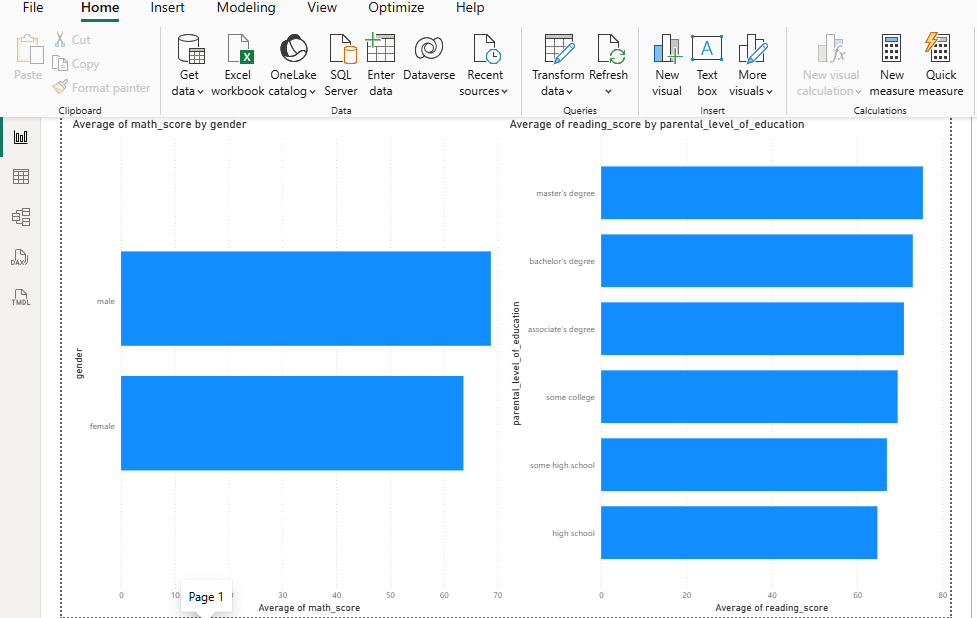
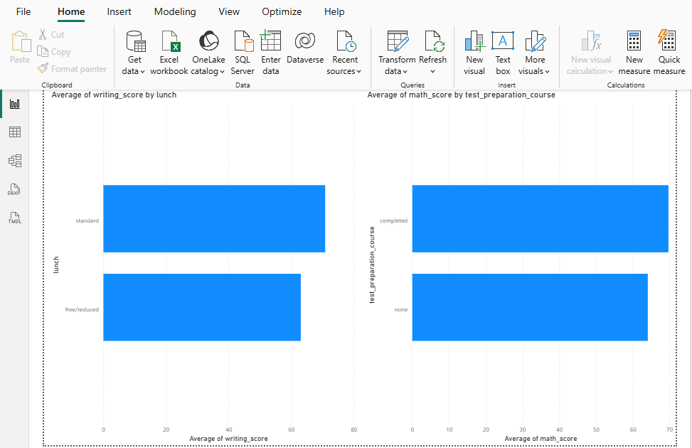

# Student Performance Dashboard - Power BI

Interactive Power BI dashboard analyzing student exam performance data, connected directly to a SQL Server database.

## Tools Used
- Power BI Desktop
- SQL Server (data source)

## Dashboard Overview

### Page 1: Gender & Parental Education Analysis

- Average math score by gender
- Average reading score by parental education level

### Page 2: Lunch Type & Test Preparation Analysis

- Average writing score by lunch type (income indicator)
- Average math score by test preparation course completion

## Key Insights
- Students whose parents hold a master's or bachelor's degree scored higher on average in reading.
- Students with standard lunch (higher income indicator) scored higher than those with free/reduced lunch.
- Completing a test preparation course is associated with higher average math scores.

## Data Source
Connected live to a SQL Server database (`StudentPerformanceDB`) containing 1,000 student records.
